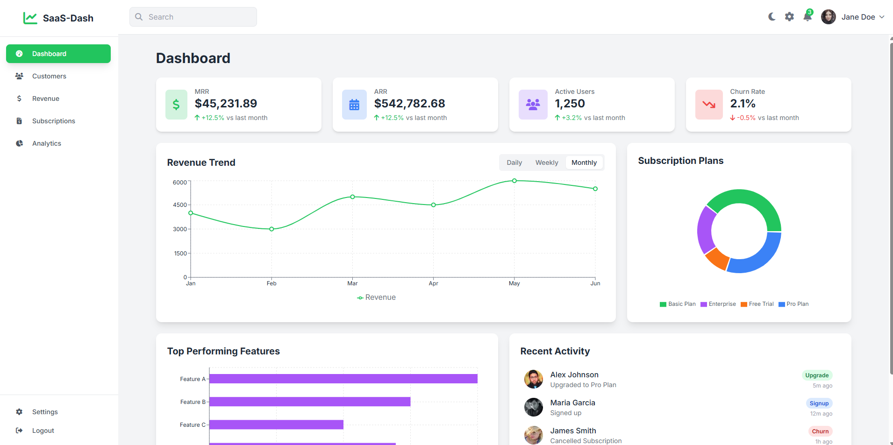
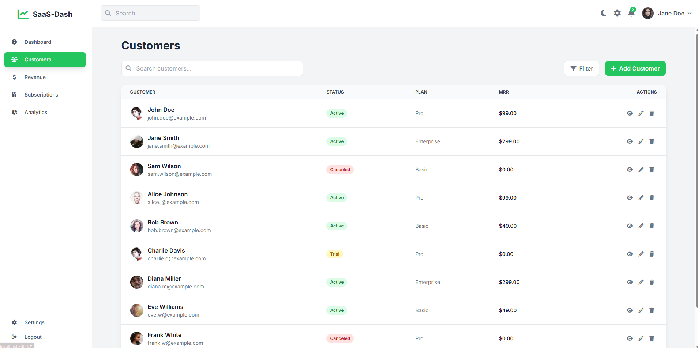
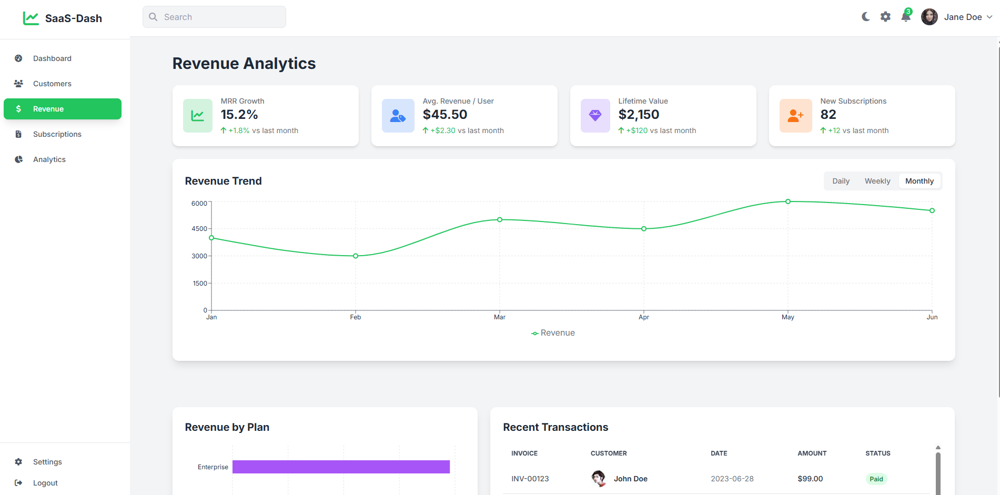
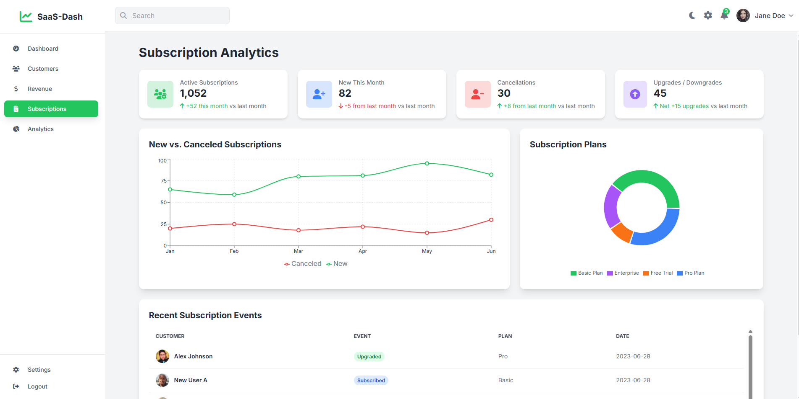
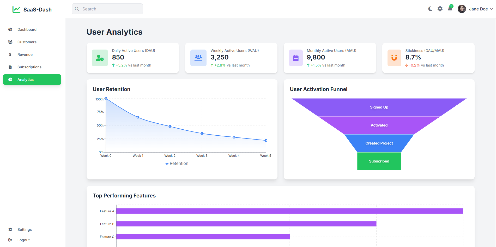

# 📊 E-Commerce Sales Dashboard

A modern, responsive **React** application built for visualizing e-commerce sales analytics.
This dashboard displays sales, customers, product performance, marketing insights, and inventory information — all in one clean interface.

## 🔗 Live Demo

👉 **Live URL:** *Add your live link here*

---

## ✨ Features

### 📈 Sales Analytics

* Total sales, revenue, orders
* Daily / weekly / monthly / yearly comparisons
* Sales trend line charts
* Conversion rate
* Average order value (AOV)

### 🛒 Product Performance

* Best-selling products
* Low inventory alerts
* Category performance
* Inventory status (in-stock, low, out-of-stock)

### 👥 Customer Analytics

* Total customers
* New vs returning customers
* Customer acquisition chart
* Customer lifetime value (LTV)

### 📣 Marketing & Traffic Metrics

* Traffic source breakdown
* Campaign performance
* Funnel tracking
* Coupon usage analytics

### 📦 Order Management

* Recent orders table
* Order status overview
* Delivery performance
* Export orders to CSV

### 🎨 UI / UX

* Light & Dark mode
* Fully responsive (mobile, tablet, desktop)
* Clean dashboard layout
* Search, filters, sorting

## 🛠 Tech Stack

* **React + Vite**
* **Tailwind CSS** for styling
* **React Router** for navigation
* **Recharts** for charts

## 🖼 Screenshots

*Add your screenshots here*
Example:

##Thanks 
